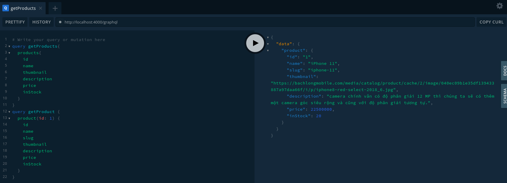

# Microservices Graphql API Gateway using gRPC

In this tutorial, we will build a Microservices architecture with gRPC and create an API Gateway as Graphql.
Let see architecture below:

### Architecture

### GraphQL Schema

## Quickstart

In order, we need to start all microservices before start Graphl Gateway 
to make sure the gateway can connecting to services success.

1. Start Product service
2. Start Gateway

## Test it

We imagine all services and gateway started correctly.

Next, open the Graphql gateway at: http://localhost:4000/graphql

