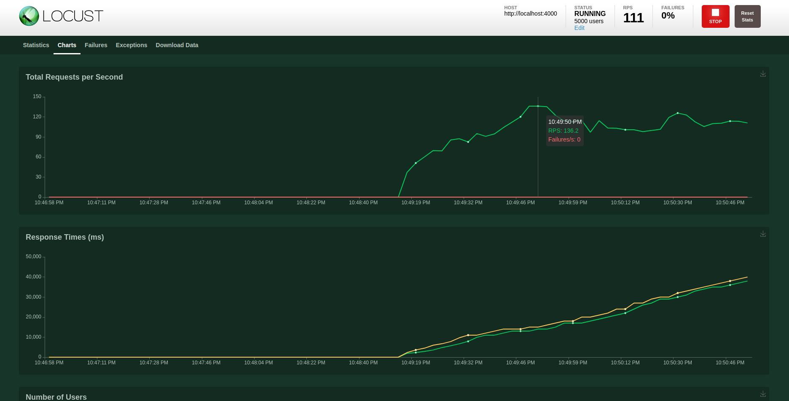

# Benchmark API Performance

We use Locust, an open source load testing tool for performance tests the api.

Define user behaviour with Python code, and swarm your system with millions of simultaneous users.

Start Locust server

```shell
locust -f benchmark.py
```


