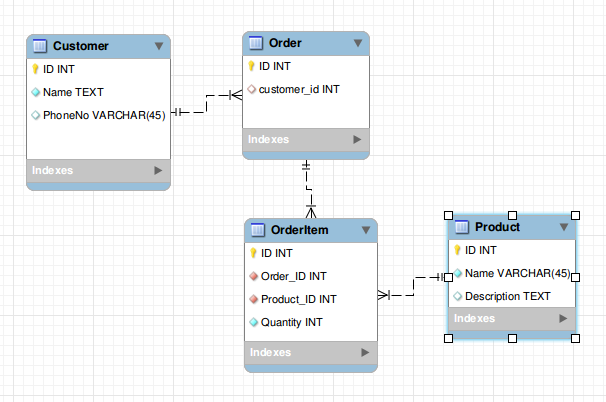

# Order Service using gRPC

Implement Order serice using gRPC and Postgresql

Architect 



## TODO

- [x] Create a new order
- [x] Get order by Id
- [ ] Update an order
- [ ] Delete an order
- [ ] Get list of orders by customer

## Quickstart

Step 1: Create a python virtualenv

```shell
cd orders
virtualenv -p python3 orders-venv
source orders-venv/bin/activate
pip install -r requirements.txt
```

Step 2: Generate gRPC code for Product service

Inside (orders-venv) environment run this command to generate gRPC code

```shell
cd orders
PROTOS_DIR_IN=../proto
PROTOS_DIR_OUT=./
PROTO_FILE=../proto/orders.proto
python3 -m grpc_tools.protoc -I $PROTOS_DIR_IN --python_out=$PROTOS_DIR_OUT --grpc_python_out=$PROTOS_DIR_OUT $PROTO_FILE
```

Step 3: Start Product service

```shell
python3 server.py
```

## Database

Demo 

python inserts.py

python python queries.py 